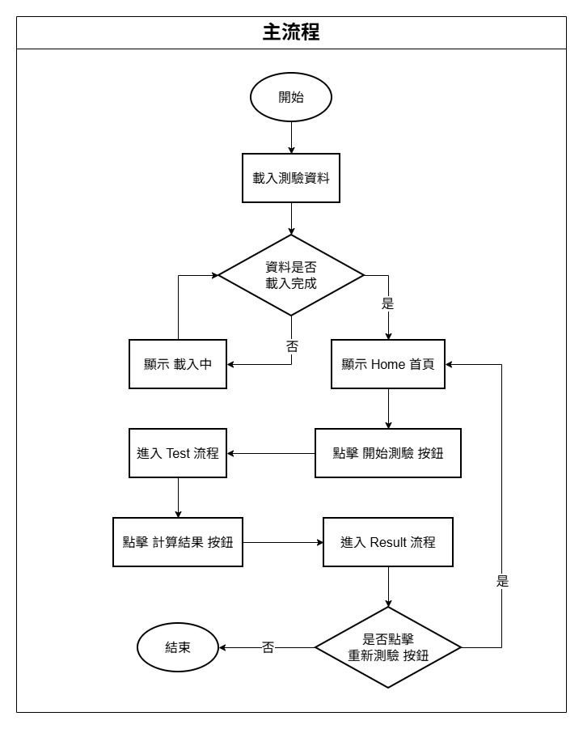
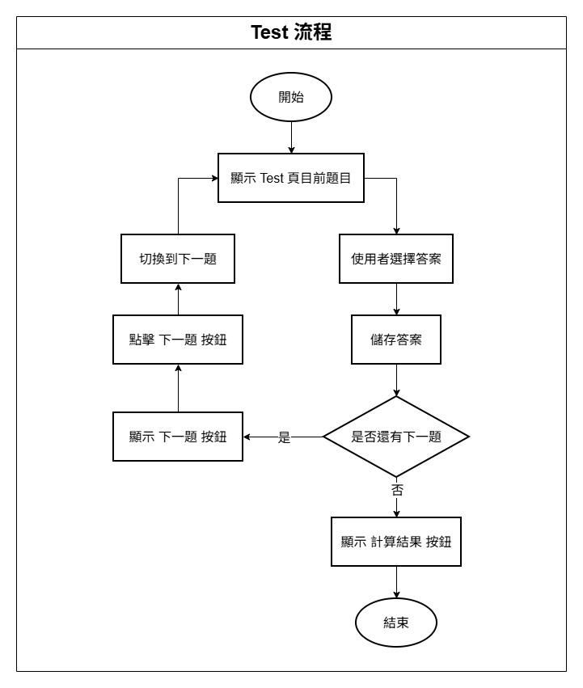
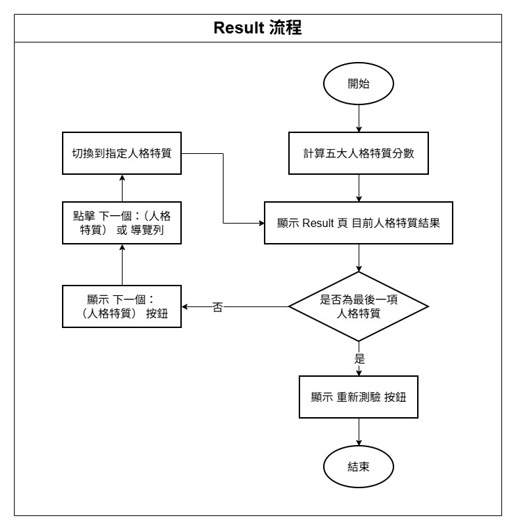
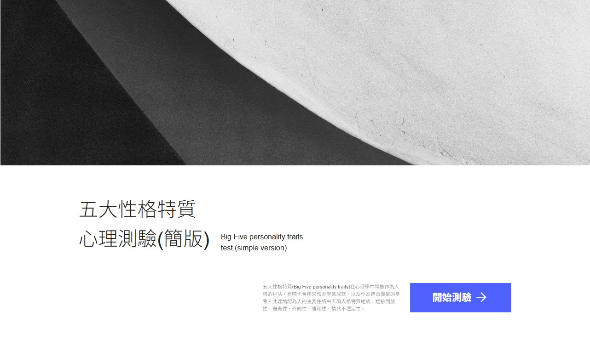
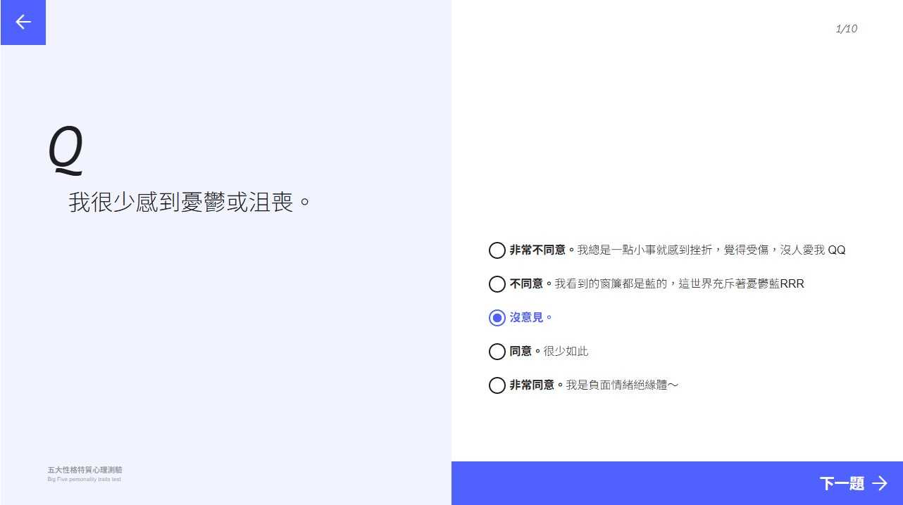
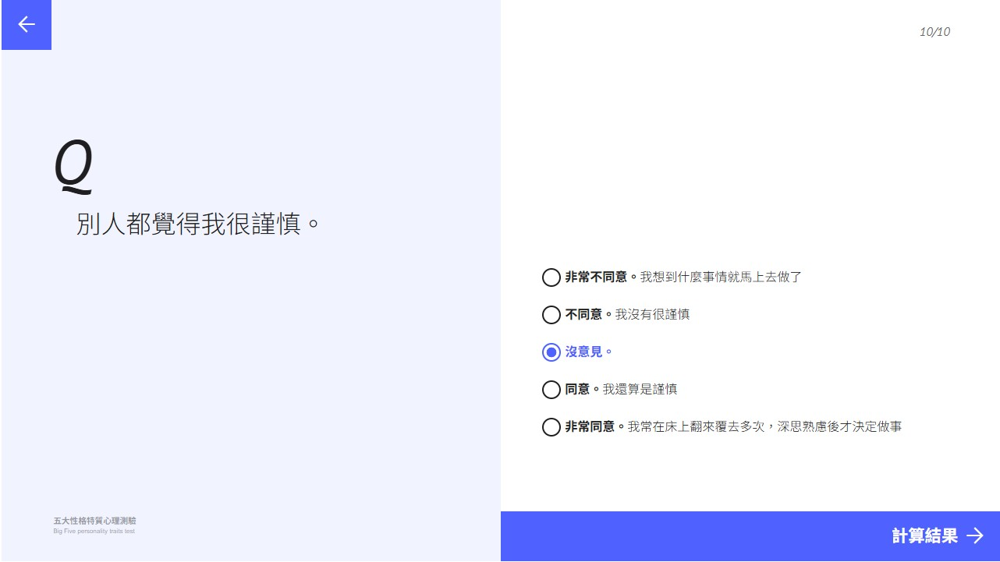
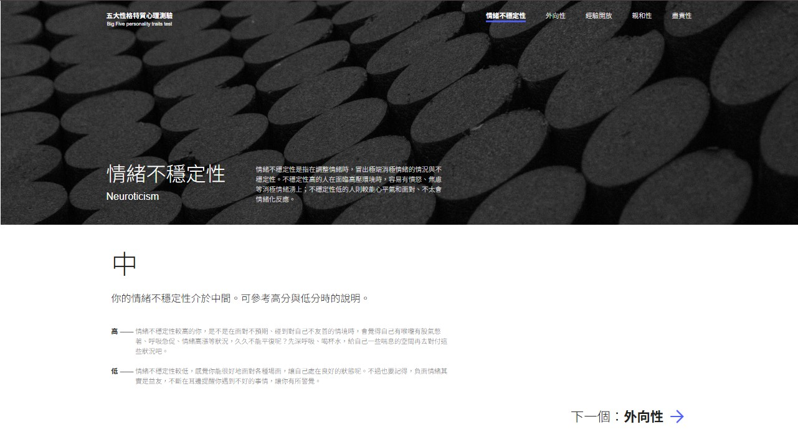

<h1 align="center">🧠 五大性格特質心理測驗</h1>

<p align="center">
  一個以 React 打造的互動式心理測驗，透過簡單直覺的流程，快速了解個人的性格特質與行為傾向
</p>

<p align="center">
  <a href="https://react.dev/">
    
  </a>
  <a href="https://vitejs.dev/">
    
  </a>
  <a href="https://reactrouter.com/">
    
  </a>
  <a href="https://sass-lang.com/">
    
  </a>
</p>

---

## 📌 專案介紹

本專案為前端練習專案，模擬常見的心理測驗流程。使用者可依序回答題目，系統會依作答結果計算五大性格的得分，並以分頁方式呈現各項性格的分析結果。

整體流程設計以「一步一題、即時記錄、清楚呈現結果」為核心，讓使用者能專注於作答體驗。

---

## 🔄 流程設計

### 🧩 主流程（Main Flow）


- 載入測驗資料
- 顯示首頁（Home）
- 點擊開始測驗後進入測驗流程
- 完成測驗後進入結果流程
- 可選擇重新測驗並返回首頁

### 📝 測驗流程（Test Flow）


- 顯示當前題目
- 使用者選擇答案並儲存
- 若尚有下一題，顯示「下一題」按鈕
- 最後一題顯示「計算結果」按鈕
- 點擊後進入結果頁

### 📊 結果流程（Result Flow）


- 計算五大性格特質分數
- 顯示目前性格特質的結果與說明
- 可切換查看下一個性格特質
- 最後顯示「重新測驗」按鈕

---

## 📸 專案畫面

### 首頁畫面


### 測驗頁畫面



### 結果頁畫面



---

## ✨ 功能說明

- **首頁（Home）**
  - 點擊「開始測驗」進入測驗流程

- **測驗頁（Test）**
  - 依照題目索引，一頁顯示一題
  - 每題提供 5 個選項（非常不同意～非常同意）
  - 選擇後即時記錄作答內容
  - 點擊「下一題」切換至下一題
  - 最後一題可計算測驗結果並進入結果頁

- **結果頁（Result）**
  - 根據作答計算五大性格特質分數（高／中／低）
  - 一頁顯示一種性格的分數與對應描述
  - 可透過「下一個性格」或上方導覽列切換檢視
  - 點擊「重新測驗」返回首頁

- **頁面切換**
  - 使用 `HashRouter` 管理路由
  - Home / Test / Result 為獨立頁面

---

## 📁 專案結構

```text
src/
├─ public/
│  ├─ favicon.jpg
│  └─ og-image.jpg
│
├─ assets/
│  ├─ icons/          # 共用圖示
│  ├─ images/         # 共用圖片
│  └─ styles/         # 全域樣式設定
│       ├─ _mixins.scss
│       ├─ _typography.scss
│       ├─ _variables.scss
│       └─ global.scss
│
├─ pages/             # 頁面層級（對應路由）
│  ├─ Home/
│  │   └─ index.jsx
│  ├─ Test/
│  │   └─ index.jsx
│  └─ Result/
│      └─ index.jsx
│
├─ components/        # 各頁 View 與子元件
│  ├─ HomeView/
│  ├─ TestView/
│  └─ ResultView/
│
├─ services/          # API 呼叫與資料處理
│  └─ fetchBigFive.js
│
├─ App.jsx            # 路由設定
└─ main.jsx           # 專案進入點
```

---

## 🛠 使用技術

- React 19
- Vite
- React Router
- SCSS（CSS Module）
- modern-css-reset
- Axios

---

## 🚀 安裝與執行

```
# 安裝套件
npm install

# 啟動開發環境
npm run dev
```

---

## 📦 部署方式

```
# 建置專案
npm run build

# 部署至 GitHub Pages
npm run deploy
```

